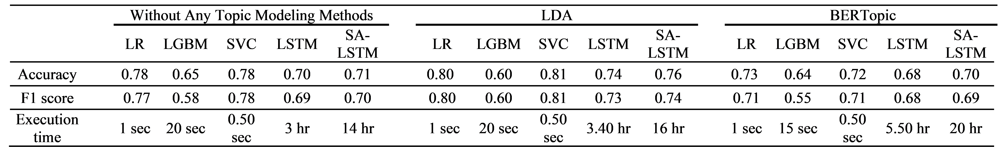
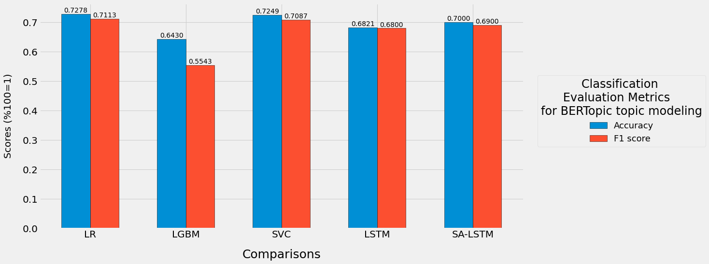

# Customer Call Center Topic Modeling
In this work, using the data of 20,000 Turkish phone conversations coming to a customer call center of a brand serving the electronic products sector from the conversations; topic extraction was done using topic modeling methods LDA and BERTopic.

# Info
First, the data received from the system was passed through the processes of cleaning, editing typos. Then, the models were created and the topic extraction process was performed. Then, in order to evaluate the subject inferences of the models, the coherence scores, diversity measurements and the score values of each model were compared according to the duration and number of subjects.

In the scope of this work, respectively, C_v score 0.3401, 0.6612; topic diversity score 0.8000, 0.7600; Jaccard Distance 0.9369, 0.9181; inversed rank-biased overlap value average 0.9364, 0.9220 values were reached with LDA and BERTopic.

___

# Libraries
All codes written in Google Colab. The following Python libraries are also required:

- bertopic
- transformers==4.11.3
- tokenizers==0.10.3
- sentencepiece==0.1.96
- pandas
- wordcloud==1.8.1
- matplotlib.pyplot
- gensim==4.1.2
- nltk
- re
- collections
- numpy
- [diversity metrics](https://github.com/silviatti/topic-model-diversity)
- time
- warnings
- tensorflow/keras
- imblearn
- math
- scikit-learn
- datetime
- lightgbm
- bertopic

# Dataset
I am unable to share the dataset for educational and academic use.
